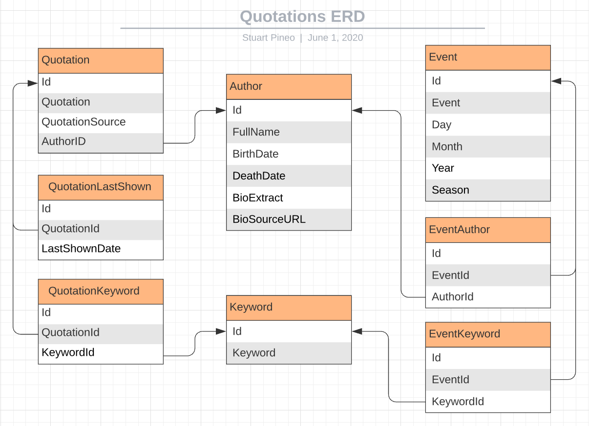

# About Quotations

This project involves developing a simple Web Application that displays quotations based on context such as date, event, or degree of relevance. An example context would be to display a quotation by a famous historical personality on his/her birthday. Another one, to display a quotation relevant to a current event. A last one, where date or event relevance is not available, have the relevance be based on keywords association.

Quotations are often a powerful way to convey meaning, inspiration, and emotion in just a few words. The effect can be even more powerful when the quotation is associated with a specific context. From a development standpoint, a tool can be easily created to uncover these associations. In addition, since quotations and information about the authors who inspired those quotations is readily available online, much of the data can be easily mined using Web automation tools.


## Components

This project is still evolving but my initial specification will include the following components:

* More detailed description of the targetted functionality including use cases.
* Listing of the data elements that will be required for this application.
* Schema (i.e., ER diagram) that captures the data elements and their relations (to be stored in a relational database).
* A set of Web automation tools written in Perl to mine much of the data and dump it to text files (since not all quotations are created equal, I will pare down the initial dump)
* A Web Framework (I have picked Django/Python for its simplicity and versatility). Through this framework we will also specify the design of the back-end database schema and go into more implementation details (including client-side scripting)
* A set of database loader scripts that takes as input the text file(s) generated by the Web automation tools.

## Description

As mentioned, in the interest of making this a _simple_ Web Application, below are my initial use cases:

1. The home page by default displays the most relevant quote associated with the current date along with a brief bio about the author (if no date-specific relevance is found, an association derived from keyword relevance is made). This is our _detail_ view. An example date-relevant quotation and bio might be the one below if the current date is October 2nd:

> "The future depends on what we do in the present." - Mahatma Gandhi
>
> Mohandas Karamchand Gandhi, born on this day 1869, was an Indian lawyer, anti-colonial nationalist, and political
> ethicist, who employed nonviolent resistance to lead the successful campaign for India's independence from British Rule, 
> and in turn inspire movements for civil rights and freedom across the world (source: extract from [Wikipedia](https://en.wikipedia.org/wiki/Mahatma_Gandhi))

2. Refreshing the home page displays the next-most relevant quote (or, if none available, one based on keyword relevance). Still on _detail_ view, an example keyword-relevant quotation using the current month might be the one below if a specific-date context is not available:

> "As full of spirit as the month of May, and as gorgeous as the sun in Midsummer" - William Shakespeare
>
> William Shakespeare (bapt. 26 April 1564 – 23 April 1616) was an English poet, playwright, and actor, widely regarded as 
> the greatest writer in the English language and the world's greatest dramatist. He is often called England's national poet 
> and the "Bard of Avon" (or simply "the Bard"). His extant works, including collaborations, consist of some 39 plays, 154 
> sonnets, two long narrative poems, and a few other verses, some of uncertain authorship. His plays have been translated 
> into every major living language and are performed more often than those of any other playwright (source: extract from [Wikipedia](https://en.wikipedia.org/wiki/William_Shakespeare))

3. A search field allows a user to enter a search term and return a list (ordered by relevance) of quotations associated with that term. The number returned can be specified from a selection widget (i.e., in increments of 5 or 10). This is our _list_ view that shows only the quotation and author associated with each returned item along with a link to the _detail_ view (that includes the author bio as showbn above)

That's it for use cases (at least for now)

## Data Elements and Schema

1. The Starting point is cataloging a series of _Events_ and their associated _Dates_ and/or _Seasons_ (from the event _Author_ and/or _Keywords_ relations we will find the most relevant quotation(s))
2. The _Quotations_ and _Authors_ (as well as any _Source_ associated with each quotation) are of course stored. As we discussed, an author has certain attributes associated with him/her such as _Birth/Death Date_ and _Bio_ information. The quotation might also have one or more _Keywords_ associated with it which can tie it to events or user initiated queries.
3. Finally, we want to keep track of when the quotation was last shown and thus prevent it from being re-displayed when user refreshes the browser (unless it is included in the returned list of a user initiated search)

Our first draft of the schema or _Entity-Relation Diagram (ERD)_ might look like the one below:



In a real query we may get zero or more events associated with a date (in the case of zero, we might pull in event(s) by associating month or season to today's date). With multiple events, we might give precedence to those events tied to an author as oppposed to just a keyword (though even a single author might have multiple quotations so we would need to decide which one to display)

In the ideal world, a tie breaker might best be broken by pulling in some currently _trending topics_ (perhaps something for version 2.0 of this app!)

## Web Automation Tools and Data

### Web Scrape the Quotes

The purpose of these tools is to pull raw data when possible. Much of the data "cleanup" will be done manually. This will include deciding which quotations and events to include as well as which keywords to associate.

I have created, as generic as possible, a Web automation [script](https://github.com/spineo/perl-scripts/blob/master/bin/quotes/scrape_quotes.pl) located in my [perl-scripts](https://github.com/spineo/perl-scripts/) GitHub repository to pull a few thousand _quotations/authors_ from one or more sites as well as an optional _source_ (for this site, usually a book reference) and _keywords_. A short extract from the raw data generated is shown below:

```
You've gotta dance like there's nobody watching###William W. Purkey######dance,heaven,hurt,inspirational,life,love,sing
You know you're in love when you can't fall asleep because reality is finally better than your dreams.###Dr. Seuss######attributed-no-source,dreams,love,reality,sleep
A friend is someone who knows all about you and still loves you.###Elbert Hubbard######friend,friendship,knowledge,love
Darkness cannot drive out darkness: only light can do that. Hate cannot drive out hate: only love can do that.###Martin Luther King Jr.###A Testament of Hope: The Essential Writings and Speeches###darkness,drive-out,hate,inspirational,light,love,peace
We accept the love we think we deserve.###Stephen Chbosky###The Perks of Being a Wallflower###inspirational,love
```

The script is run with the required command-line option '--config' which points to a scrape site specific configuration file. An example site [template](https://github.com/spineo/perl-scripts/blob/master/conf/quotes/scrape_quotes.site.template) is checked into the _conf/quotes_ directory of the _perl-scripts_ repository. For any sites I visit, at least for now, will not plan on using any available feeds (i.e., RSS) to extract data.

Note: Make sure that extraction of content does not infringe on copyrights (especially if used for commercial purposes)

### Create the Initial List of Authors

Since the script can potentially retrieve tens of thousands of quotes (of which well over 99% are of no value to me) I decided to perform an intial filtering by author. For this manual exercise I arbitrarily came up with 100 [authors](data/authors.txt) (with a few added later) spanning multiple nationalities and occupations. The criteria for picking these authors was that they are (or were) masters in their endevours or occupations, in at least some aspect of their life were worthy of my admiration, and had attributed to them two or more quotations that were inspiring or thought provoking.

### Associate Additional Author Information

As I produced this list, I also associated the additional fields birth date, death date (if deceased), title/short description and a link (i.e., Wikipedia) to the bio. To automate this scrape, I implemented the script [_scrape_authors_info.pl_](https://github.com/spineo/perl-scripts/blob/master/bin/quotes/scrape_authors_info.pl) that used as input a scrape site specific configuration file ([_scrape_authors_info.site.template_](https://github.com/spineo/perl-scripts/blob/master/conf/quotes/scrape_authors_info.site.template) and the list of authors and output the new list [_authors_info_](data/authors_info.txt) with additional information. The script correctly found the bio and generated the url for all authors in the list (using Wikipedia) but had incomplete and/or erroneous data in 26/100 scrapes (much due to inconsistent formatting of the Wikipedia markup and dates content). Rather than make the script more generalizable and handle at least most of the remaining cases, I decided (at least for now) to fix these manually and add them to a separate file ([_authors_info_manual_](data/authors_info_manual.txt)). The filter script below can then takes as input a catenated file containing both lists.

### Create the Initial List of Events

The initial list of events (at least to be used during the testing phase) was also produced manually and saved to the [_events.txt_](data/events.txt) file and includes author name (for now just events tied to an author), date of the event, event name, and keywords associated with author/event.

### Filter the Quotes and tie them to the Authors/Events

 The [_filter_quotes.pl_](https://github.com/spineo/perl-scripts/blob/master/bin/quotes/filter_quotes.pl) script creates an intermediate data structure based on the authors information and keyed by the lowercased/dash-separated/stripped full name with the Events and Quotes subsequently associated with the author.

Pretty printed output for _Albert Einstein_ is shown below using the --debug flag (the output used by the loader is JSON formatted). A command-line option allows applying a filter by quote size (for this run any quote over 100 characters got tossed). While there a few quotes of interest in this example, they are certainly not Einstein's best. In addition, a couple of quotes need translation and at least one is incomplete (clearly some manual effort will be required to remove and add quotations)
```
          'albert-einstein' => {
                                 'lname_sig' => 'einstein',
                                 'name' => 'Albert Einstein',
                                 'birth_date' => '1879-03-14',
                                 'description' => 'German-born physicist and developer of the theory of relativity (1879-1955)',
                                 'death_date' => '1955-04-18',
                                 'quotes' => [
                                               {
                                                 'author' => 'Albert Einstein',
                                                 'keywords' => 'albert-einstein,quote',
                                                 'source' => 'Ideas and Opinions',
                                                 'quote' => 'Student is not a container you have to fill but a torch you have to light up.'
                                               },
                                               {
                                                 'source' => '',
                                                 'quote' => 'Anyone who doesn\'t take truth seriously in small matters cannot be trusted in large ones either.',
                                                 'author' => 'Albert Einstein',
                                                 'keywords' => 'albert-einstein,truth'
                                               },
                                               {
                                                 'quote' => 'Weak people revenge. Strong people forgive. Intelligent people ignore.',
                                                 'source' => '',
                                                 'keywords' => 'advice,albert-einstein',
                                                 'author' => 'Albert Einstein'
                                               },
                                               {
                                                 'keywords' => 'albert-einstein,crisis,opportunity',
                                                 'author' => 'Albert Einstein',
                                                 'quote' => 'In the midst of every crisis, lies great opportunity.',
                                                 'source' => ''
                                               },
                                               {
                                                 'source' => '',
                                                 'quote' => 'Racism is a disease of white people',
                                                 'author' => 'Albert Einstein',
                                                 'keywords' => 'albert-einstein,civil-rights-movement,famous,racism,segregation'
                                               },
                                               {
                                                 'source' => '',
                                                 'quote' => 'The most aggravating thing about the younger generation is that I no longer belong to it.',
                                                 'author' => 'Albert Einstein',
                                                 'keywords' => 'aggravating,albert-einstein,generation,life,young,youth'
                                               },
                                               {
                                                 'source' => '',
                                                 'quote' => 'Autoritätsdusel ist der größte Feind der Wahrheit.',
                                                 'author' => 'Albert Einstein',
                                                 'keywords' => '1901,1993,albert-einstein,paul-carter,roger-highfield'
                                               },
                                               {
                                                 'source' => '',
                                                 'quote' => 'Aku takut suatu hari teknologi akan melampaui interaksi manusia. Dunia akan memiliki generasi idiot',
                                                 'author' => 'Albert Einstein',
                                                 'keywords' => 'albert-einstein'
                                               },
                                               {
                                                 'keywords' => 'austerity,curie,experimental-science,fortune,friendship,grandeur,intuition,marie-curie,nobel-laureate,purity,science,scientist,strength',
                                                 'author' => 'Albert Einstein',
                                                 'quote' => 'It was my good fortune to be linked with',
                                                 'source' => 'Out of My Later Years: The Scientist, Philosopher, and Man Portrayed Through His Own Words'
                                               }
                                             ],
                                 'events' => [
                                               {
                                                 'keywords' => 'albert-einstein,nobel-physics-prize',
                                                 'event_date' => '1922-11-09',
                                                 'event' => 'Albert Einstein was awarded the 1921 Nobel Prize in Physics "for his services to Theoretical Physics, and especially for his discovery of the law of the photoelectric effect."'
                                               }
                                             ],
                                 'bio_url' => 'https://en.wikipedia.org/wiki/Albert_Einstein'
                               },

```

Alternatively, the filtering script can output the author keywords and then have the quote extraction script apply these directly when searching the site(s) (instead of returning and then filtering a broader search keyed by topic)

## Web Framework

As mentioned, the Web Framework used will be [Django](https://www.djangoproject.com) which is implemented with Python. The application will be running on a Mac OS (Python v3.7.6 and Django v3.0)

Since the setup, at least initially, is not geared to a heavy-weight and/or production environment I will skip the installation of Apache and mod_wsgi as suggested in the [installation](https://docs.djangoproject.com/en/3.0/topics/install/) instructions.

Similarly, I will use [_SQLite_](https://www.sqlite.org/index.html) as the database which already comes bundled with Django and should be adequately support our schema design and processing demands. Since SQLite does not effectively deal with concurrency, switching to a more powerfull database such as MySQL, MariaDB or PostgreSQL is recommended if application is made externally facing.

### Installing Django

After installing _pip_ you can run the following command (output shown below):
```
python3 -m pip install django
Collecting django
  Downloading Django-3.0.7-py3-none-any.whl (7.5 MB)
     |████████████████████████████████| 7.5 MB 4.3 MB/s 
Collecting pytz
  Downloading pytz-2020.1-py2.py3-none-any.whl (510 kB)
     |████████████████████████████████| 510 kB 3.7 MB/s 
Collecting asgiref~=3.2
  Downloading asgiref-3.2.7-py2.py3-none-any.whl (19 kB)
Collecting sqlparse>=0.2.2
  Downloading sqlparse-0.3.1-py2.py3-none-any.whl (40 kB)
     |████████████████████████████████| 40 kB 4.3 MB/s 
Installing collected packages: pytz, asgiref, sqlparse, django
Successfully installed asgiref-3.2.7 django-3.0.7 pytz-2020.1 sqlparse-0.3.1
```

After the installation we can always confirm the version by running:
```
python3 -m django --version
3.0.7
```

### Creating the Initial Project and App Structure

Using the _django-admin_ utility allows to easily create our initial project structure. From our root git directory run:
```
django-admin startproject quotations .
```
In addition to the _manage,py_ (more on this later), the sub-directory _quotations_, which is the actual Python package for the project, will be created. Using the handy _tree_ command (run _brew install tree_ to install) we can examine the generated files under this directory which we will configure as the application evolves:
```
tree quotations/
quotations/
├── __init__.py
├── asgi.py
├── settings.py
├── urls.py
└── wsgi.py
```

We can now test, from the git root directory, that the basic project works by running:
```
python3 manage.py runserver
```

If startup goes well you should get the below message:
```
June 08, 2020 - 21:03:44
Django version 3.0.7, using settings 'quotations.settings'
Starting development server at http://127.0.0.1:8000/
Quit the server with CONTROL-C
```

Going to that [url](http://127.0.0.1:8000/) you should see a standard Django welcome page (in my case "The install worked successfully! Congratulations!"). To use a port other than the default one, you can run the same command with the target port at the end.


Now we will run (from the root directory) the command to create the specific app which we will name _myquotes_ and which will contain our query/display code:
```
python3 manage.py startapp myquotes
```

Using our tree command, we verify the app structure:
```
myquotes/
├── __init__.py
├── admin.py
├── apps.py
├── migrations
│   └── __init__.py
├── models.py
├── tests.py
└── views.py
```

Finally, before moving on to the models, lets test auto-generating a simple index file and verify that it works (like the standard Django tutorials suggest)

Create a _myquotes/urls.py_ file and add the below code:
```
from django.urls import path

from . import views

urlpatterns = [
    path('', views.index, name='index'),
]
```

In the _myquotes/views.py_ add the below content:
```
from django.http import HttpResponse


def index(request):
    return HttpResponse("This is my test quotations index file.")
```

To integrate _myquotes_, in main _quotations/urls.py_ add the below code:
```
from django.contrib import admin
from django.urls import include, path

urlpatterns = [
    path('myquotes/', include('myquotes.urls')),
    path('admin/', admin.site.urls),
]
```

Run the application as before (_python3 manage.py runserver_) and verify the new url rendering at http://127.0.0.1:8000/myquotes with the text you just added.

### Setting up the Backend Database and Mapping the ERD to _models.py_

By default, Django comes bundled with the SQLite database which we will use (at least initially). However, we will need to configure where the database file will be stored. To do this, edit the _quotations/settings.py_ file to include the below new _DATA_DIR_ references (the _data/myquotes.sqlite3_ file, initially empty, is checked into the git repository)

```
BASE_DIR = os.path.dirname(os.path.dirname(os.path.abspath(__file__)))
DATA_DIR = os.path.join(BASE_DIR, 'data')

...

DATABASES = {
    'default': {
        'ENGINE': 'django.db.backends.sqlite3',
        'NAME': os.path.join(DATA_DIR, 'myquotes.sqlite3'),
    }
}
```

In this file, you can also change the default 'UTC' timezone if needed (in my case, I set _TIME_ZONE = 'US/Eastern'_). As we move along, we will make additional changes to this configuration file.

In order to map our ERD created earlier to the database using the built-in Django Object Relation Mapping (ORM) we will edit the file [_myquotes/models.py_](myquotes/models.py) and include the classes (that subclass _django.db.models.Model_) and generally map to the database tables and the class variables, which map to the database fields.

The Models (at least the first draft) that capture the ERD shown earlier are defined below:
```
from django.db import models
from django.core.validators import MaxValueValidator, MinValueValidator
import calendar

# The primary key field for each class is auto-generated
#
class Author(models.Model):
    full_name        = models.CharField(max_length=100, unique=True)
    birth_date       = models.DateField()
    death_date       = models.DateField()
    bio_extract      = models.CharField(max_length=400)
    bio_source_url   = models.URLField()

class Quotation(models.Model):
    quotation        = models.CharField(max_length=200, unique=True)
    quotation_source = models.CharField(max_length=100, null=True)
    author_id        = models.ForeignKey(Author, on_delete=models.CASCADE)

class Event(models.Model):
    MONTH_CHOICES    = [(str(i), calendar.month_name[i]) for i in range(1,13)]
    SEASON_CHOICES   = [
        ('WINTER', 'Winter'),
        ('SPRING', 'Spring'),
        ('SUMMER', 'Summer'),
        ('FALL',   'Fall'),
    ]

    def current_year():
        return datetime.date.today().year

    def max_value_current_year(value):
        return MaxValueValidator(current_year())(value)

    event            = models.CharField(max_length=100, unique=True)
    day              = models.IntegerField(validators=[MaxValueValidator(31), MinValueValidator(1)], null=True) 
    month            = models.CharField(max_length=9, choices=MONTH_CHOICES, default=1, null=True)
    year             = models.IntegerField(validators=[max_value_current_year, MinValueValidator(-1000)], null=True)
    season           = models.CharField(max_length=6, choices=SEASON_CHOICES, null=True)

class Keyword(models.Model):
    keyword          = models.CharField(max_length=50, unique=True)

class QuotationLastShown(models.Model):
    quotation_id     = models.OneToOneField(Quotation, on_delete=models.CASCADE)
    last_shown_date  = models.DateField()

class QuotationKeyword(models.Model):
    quotation_id     = models.OneToOneField(Quotation, on_delete=models.CASCADE)
    keyword_id       = models.ManyToManyField(Keyword)

class EventAuthor(models.Model):
    event_id         = models.OneToOneField(Event, on_delete=models.CASCADE)
    author_id        = models.OneToOneField(Author, on_delete=models.CASCADE)

class EventKeyword(models.Model):
    event_id         = models.ManyToManyField(Event)
    keyword_id       = models.ManyToManyField(Keyword)
```

We will now modified the [_quotations/settings.py_](quotations/settings.py) to include the 'myquotes' app we just defined in the list of _INSTALLED_APPS_:
```
INSTALLED_APPS = [
    'myquotes',
    'django.contrib.admin',
    'django.contrib.auth',
    'django.contrib.contenttypes',
    'django.contrib.sessions',
    'django.contrib.messages',
    'django.contrib.staticfiles',
]
```

By running the command _python3 manage.py makemigrations myquotes_ we will create the intermediate format for the models that can be mapped to the database entities (this command can be run every time we change the model and provides a means to fix any syntax problems with the _models.py_). Once successful, you will get the below output and the intermediate structures stored in the latest migration (i.e., [_myquotes/migrations/0001_initial.py_](myquotes/migrations/0001_initial.py) file)
```
Migrations for 'myquotes':
  myquotes/migrations/0001_initial.py
    - Create model Author
    - Create model Event
    - Create model Keyword
    - Create model Quotation
    - Create model QuotationLastShown
    - Create model QuotationKeyword
    - Create model EventKeyword
    - Create model EventAuthor
```

You can also view the _SQL_ (shown below) that gets generated and applied to the database by running the command _python3 manage.py sqlmigrate myquotes 0001_. Notice the additional entities that get auto-generated such as primary keys and indexes.
```
BEGIN;
--
-- Create model Author
--
CREATE TABLE "myquotes_author" ("id" integer NOT NULL PRIMARY KEY AUTOINCREMENT, "full_name" varchar(100) NOT NULL UNIQUE, "birth_date" date NOT NULL, "death_date" date NOT NULL, "bio_extract" varchar(400) NOT NULL, "bio_source_url" varchar(200) NOT NULL);
--
-- Create model Event
--
CREATE TABLE "myquotes_event" ("id" integer NOT NULL PRIMARY KEY AUTOINCREMENT, "event" varchar(100) NOT NULL UNIQUE, "day" integer NULL, "month" varchar(9) NULL, "year" integer NULL, "season" varchar(6) NULL);
--
-- Create model Keyword
--
CREATE TABLE "myquotes_keyword" ("id" integer NOT NULL PRIMARY KEY AUTOINCREMENT, "keyword" varchar(50) NOT NULL UNIQUE);
--
-- Create model Quotation
--
CREATE TABLE "myquotes_quotation" ("id" integer NOT NULL PRIMARY KEY AUTOINCREMENT, "quotation" varchar(200) NOT NULL UNIQUE, "quotation_source" varchar(100) NULL, "author_id_id" integer NOT NULL REFERENCES "myquotes_author" ("id") DEFERRABLE INITIALLY DEFERRED);
--
-- Create model QuotationLastShown
--
CREATE TABLE "myquotes_quotationlastshown" ("id" integer NOT NULL PRIMARY KEY AUTOINCREMENT, "last_shown_date" date NOT NULL, "quotation_id_id" integer NOT NULL UNIQUE REFERENCES "myquotes_quotation" ("id") DEFERRABLE INITIALLY DEFERRED);
--
-- Create model QuotationKeyword
--
CREATE TABLE "myquotes_quotationkeyword" ("id" integer NOT NULL PRIMARY KEY AUTOINCREMENT, "quotation_id_id" integer NOT NULL UNIQUE REFERENCES "myquotes_quotation" ("id") DEFERRABLE INITIALLY DEFERRED);
CREATE TABLE "myquotes_quotationkeyword_keyword_id" ("id" integer NOT NULL PRIMARY KEY AUTOINCREMENT, "quotationkeyword_id" integer NOT NULL REFERENCES "myquotes_quotationkeyword" ("id") DEFERRABLE INITIALLY DEFERRED, "keyword_id" integer NOT NULL REFERENCES "myquotes_keyword" ("id") DEFERRABLE INITIALLY DEFERRED);
--
-- Create model EventKeyword
--
CREATE TABLE "myquotes_eventkeyword" ("id" integer NOT NULL PRIMARY KEY AUTOINCREMENT);
CREATE TABLE "myquotes_eventkeyword_event_id" ("id" integer NOT NULL PRIMARY KEY AUTOINCREMENT, "eventkeyword_id" integer NOT NULL REFERENCES "myquotes_eventkeyword" ("id") DEFERRABLE INITIALLY DEFERRED, "event_id" integer NOT NULL REFERENCES "myquotes_event" ("id") DEFERRABLE INITIALLY DEFERRED);
CREATE TABLE "myquotes_eventkeyword_keyword_id" ("id" integer NOT NULL PRIMARY KEY AUTOINCREMENT, "eventkeyword_id" integer NOT NULL REFERENCES "myquotes_eventkeyword" ("id") DEFERRABLE INITIALLY DEFERRED, "keyword_id" integer NOT NULL REFERENCES "myquotes_keyword" ("id") DEFERRABLE INITIALLY DEFERRED);
--
-- Create model EventAuthor
--
CREATE TABLE "myquotes_eventauthor" ("id" integer NOT NULL PRIMARY KEY AUTOINCREMENT, "author_id_id" integer NOT NULL UNIQUE REFERENCES "myquotes_author" ("id") DEFERRABLE INITIALLY DEFERRED, "event_id_id" integer NOT NULL UNIQUE REFERENCES "myquotes_event" ("id") DEFERRABLE INITIALLY DEFERRED);
CREATE INDEX "myquotes_quotation_author_id_id_e3ea6829" ON "myquotes_quotation" ("author_id_id");
CREATE UNIQUE INDEX "myquotes_quotationkeyword_keyword_id_quotationkeyword_id_keyword_id_f03b0cc7_uniq" ON "myquotes_quotationkeyword_keyword_id" ("quotationkeyword_id", "keyword_id");
CREATE INDEX "myquotes_quotationkeyword_keyword_id_quotationkeyword_id_171b6464" ON "myquotes_quotationkeyword_keyword_id" ("quotationkeyword_id");
CREATE INDEX "myquotes_quotationkeyword_keyword_id_keyword_id_291df85f" ON "myquotes_quotationkeyword_keyword_id" ("keyword_id");
CREATE UNIQUE INDEX "myquotes_eventkeyword_event_id_eventkeyword_id_event_id_74c7f66e_uniq" ON "myquotes_eventkeyword_event_id" ("eventkeyword_id", "event_id");
CREATE INDEX "myquotes_eventkeyword_event_id_eventkeyword_id_0a656bca" ON "myquotes_eventkeyword_event_id" ("eventkeyword_id");
CREATE INDEX "myquotes_eventkeyword_event_id_event_id_9215ad9c" ON "myquotes_eventkeyword_event_id" ("event_id");
CREATE UNIQUE INDEX "myquotes_eventkeyword_keyword_id_eventkeyword_id_keyword_id_b281797a_uniq" ON "myquotes_eventkeyword_keyword_id" ("eventkeyword_id", "keyword_id");
CREATE INDEX "myquotes_eventkeyword_keyword_id_eventkeyword_id_7a573e91" ON "myquotes_eventkeyword_keyword_id" ("eventkeyword_id");
CREATE INDEX "myquotes_eventkeyword_keyword_id_keyword_id_6f5222ff" ON "myquotes_eventkeyword_keyword_id" ("keyword_id");
COMMIT;
```

We have two more commands to run. The _python3 manage.py makemigrations_ for good measure should return "No changes detected" since this is our firsts version.

_python3 manage.py migrate_ will perform the actual migration of the latest changes applying them to our database store  (i.e., data/myquotes.sqlite3). If migration is successful you should see the below output:
```
Operations to perform:
  Apply all migrations: admin, auth, contenttypes, myquotes, sessions
Running migrations:
  Applying contenttypes.0001_initial... OK
  Applying auth.0001_initial... OK
  Applying admin.0001_initial... OK
  Applying admin.0002_logentry_remove_auto_add... OK
  Applying admin.0003_logentry_add_action_flag_choices... OK
  Applying contenttypes.0002_remove_content_type_name... OK
  Applying auth.0002_alter_permission_name_max_length... OK
  Applying auth.0003_alter_user_email_max_length... OK
  Applying auth.0004_alter_user_username_opts... OK
  Applying auth.0005_alter_user_last_login_null... OK
  Applying auth.0006_require_contenttypes_0002... OK
  Applying auth.0007_alter_validators_add_error_messages... OK
  Applying auth.0008_alter_user_username_max_length... OK
  Applying auth.0009_alter_user_last_name_max_length... OK
  Applying auth.0010_alter_group_name_max_length... OK
  Applying auth.0011_update_proxy_permissions... OK
  Applying myquotes.0001_initial... OK
  Applying sessions.0001_initial... OK
```

You can also log into the database by issuing the command _sqlite3 myquotes.sqlite3_ from /data and then running a built-in command like _.schema_ to view the applied entities.

Now that our models and database are complete, we are ready to begin populating our store (at least initially, with some test data)

## Database Loader Script

The [_load_quotes_sqlite.pl_](https://github.com/spineo/perl-scripts/blob/master/bin/quotes/load_quotes.sqlite.pl) script  takes as input the JSON formatted data structure generated by the _filter_quotes.pl_ script and loads the data into the database tables.

## References

* https://app.lucidchart.com/ (great App for creating ERD diagrams)
* https://www.djangoproject.com
* https://www.goodreads.com/quotes/ (thousands of quotes, categorized by topic)
* https://docs.djangoproject.com/en/3.0/topics/db/models/
